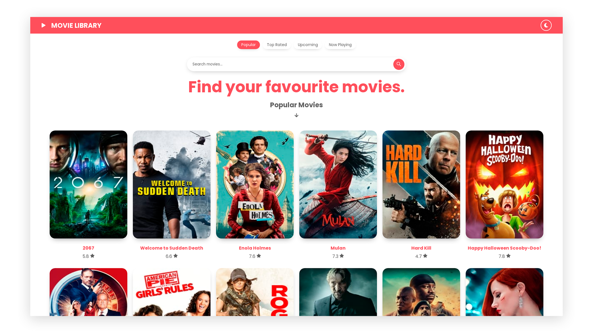

# ReactJS Movie Library

## [See live preview here](https://suhejlhadzi.github.io/movie-library/)



A simple Movie Library Created using theMovieDb API w/ dark mode.

## Getting Started

These instructions will get you a copy of the project up and running on your local machine for development, testing and learning purposes. See deployment for notes on how to deploy the project on a live system.

### Prerequisites

You need to create an API KEY in [The Movie Database API](https://www.themoviedb.org/documentation/api)
Use your API key when fetching data in components.

```
https://api.themoviedb.org/3/movie/{movie_id}?api_key=<<api_key>>&language=en-US
```

### Installing

Clone the Repository and run

```
npm install
npm run dev
```

## Deployment

To deploy simply run

```
npm run build
```

## Built With

- [React JS](https://reactjs.org/)
- [React Router](https://github.com/ReactTraining/react-router)
- [Styled Components](https://www.styled-components.com)

## Contributing

Please feel free to send pull request if you want to contribute! 

## Authors

- **SuhejlHadzi** - _Development_ - [SuhejlHadzi](https://github.com/SuhejlHadzi)
